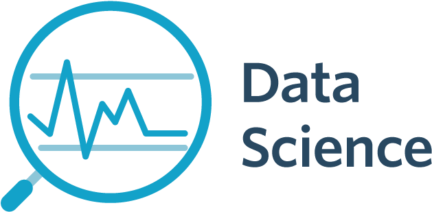

# Data Science Roadmap

 

My roadmap to Data Science studies. Based on [SergeyShk's roadmap](https://github.com/SergeyShk/DataScience-Roadmap)

## Programming
### Python
#### Courses
| URL | Title | Status |
| :---: | --- | :---: |
| [DataCamp](https://www.datacamp.com/tracks/python-programmer) | Python Programmer | To Do |
| [DataCamp](https://www.datacamp.com/tracks/data-analyst-with-python) | Data Analyst with Python | To Do |
#### Books
| Title | Author | Status |
| --- | :---: | :---: |
| Data Science From Scratch: First Principles with Python - O'Reilly | Joel Grus | To Do |

### R
#### Courses
| URL | Title | Status |
| :---: | --- | :---: |
| [DataCamp](https://www.datacamp.com/tracks/r-programmer) | R Programmer | To Do |

### Algorithms & Data Structures
#### Courses
| URL | Title | Status |
| :---: | --- | :---: |
| [Udemy](https://www.udemy.com/python-for-data-structures-algorithms-and-interviews) | Python for Data Structures, Algorithms, and Interviews! | To Do |
#### Books
| Title | Author | Status |
| --- | :---: | :---: |

## Machine Learning
### Fundamentals
#### Courses
| URL | Title | Status |
| :---: | --- | :---: |
| [Coursera](https://www.coursera.org/learn/machine-learning/) | Machine Learning | To Do |
| [DataCamp](https://www.datacamp.com/tracks/data-scientist-with-python) | Data Scientist with Python | To Do |
| [DataCamp](https://www.datacamp.com/tracks/machine-learning-scientist-with-python) | Machine Learning Scientist with Python | To Do |
| [OpenDataScience](https://mlcourse.ai/) | Open Machine Learning Course | To Do |
| [Udacity](https://www.udacity.com/course/intro-to-data-science) | Intro to Data Science | To Do |
| [Udacity](https://www.udacity.com/course/data-scientist-nanodegree--nd025) | Become a Data Scientist - Nanodegree | To Do |
| [Udemy](https://www.udemy.com/python-for-data-science-and-machine-learning-bootcamp) | Python for Data Science and Machine Learning Bootcamp | To Do |
| [Udemy](https://www.udemy.com/data-science-and-machine-learning-with-python-hands-on) | Data Science, Deep Learning, & Machine Learning with Python | To Do |
#### Books
| Title | Author | Status |
| --- | :---: | :---: |
| Sistemas de Recomendação Baseada em Conteúdo para Sistemas de Bibliotecas Universitárias | Nelson Jacob Dressler | To Do |

### Deep Learning
#### Courses
| URL | Title | Status |
| :---: | --- | :---: |
| [Udemy](https://www.udemy.com/complete-guide-to-tensorflow-for-deep-learning-with-python/) | Complete Guide to TensorFlow for Deep Learning with Python | To Do |
| [Udacity](https://www.udacity.com/course/deep-learning-pytorch--ud188) | Intro to Deep Learning with PyTorch | To Do |
#### Books
| Title | Author | Status |
| --- | :---: | :---: |
| grokking Deep Lerning | Andrew W. Trask | To Do |
| Hands-on Machine Learning with Scikit-Learn, Keras, and TensorFlow | Aurélien Géron | To Do |

### Natural Language Processing
#### Courses
| URL | Title | Status |
| :---: | --- | :---: |
| [Coursera](https://www.coursera.org/learn/language-processing) | Natural Language Processing | To Do |
| [Udemy](https://www.udemy.com/nlp-natural-language-processing-with-python) | NLP - Natural Language Processing with Python | To Do |
| [USP](https://uspdigital.usp.br/apolo/apoObterAtividade?cod_oferecimentoatv=100557) | Curso de Extensão Universitária: Python para Processamento de Linguagem Natural | **Completed** |
#### Books
| Title | Author | Status |
| --- | :---: | :---: |
| Natural Language Processing in Action | Hobson Lane, Cole Howard, Hannes Hapke | To Do |
| Text Analytics with Python: A Practitioner's Guide to Natural Language Processing | Dipanjan Sarkar | To Do |
### Computer Vision
### Reinforcement Learning
#### Books
| Title | Author | Status|
| --- | :---: | :---: |
| Reinforcement Learning With OpenAI, tensorFlow and Keras Using Python | Abhishek Nandy & Manisha Biswas | To Do|

## Data Engineering
### SQL
#### Courses
| URL | Title | Status |
| :---: | --- | :---: |
| [Coursera](https://www.coursera.org/learn/beginning-sql-server) | Beginning SQL Server | **Completed** |
| [Coursera](https://www.coursera.org/learn/manipulating-data-with-sql) | Manipulating Data with SQL | **Completed** |
| [Coursera](https://www.coursera.org/learn/sql-for-data-science) | SQL for Data Science | **Completed** |
| [DataCamp](https://www.datacamp.com/tracks/sql-fundamentals) | SQL Fundamentals | To Do |
| [DataCamp](https://www.datacamp.com/tracks/sql-server-fundamentals) | SQL Server Fundamentals | To DO |
| [Udemy](https://www.udemy.com/the-complete-sql-bootcamp) | The Complete SQL Bootcamp | To Do |

### Big Data
#### Courses
| URL | Title | Status |
| :---: | --- | :---: |
| [DataCamp](https://www.datacamp.com/tracks/data-engineer-with-python) | Data Engineer with Python | To Do |
| [Udacity](https://www.udacity.com/course/intro-to-hadoop-and-mapreduce) | Intro to Hadoop and MapReduce | To Do |
| [Udemy](https://www.udemy.com/scala-and-spark-for-big-data-and-machine-learning) | Scala and Spark for Big Data and Machine Learning | To Do |
| [Udemy](https://www.udemy.com/spark-and-python-for-big-data-with-pyspark) | Spark and Python for Big Data with PySpark | To Do |
| [Udemy](https://www.udemy.com/the-ultimate-hands-on-hadoop-tame-your-big-data) | The Ultimate Hands-On Hadoop - Tame your Big Data! | To Do |
#### Books
| Title | Author | Status |
| --- | :---: | :---: |
| Learning Elastic Stack 7.0 | Pranav Shukla, Sharath Kumar M N | To Do |

### Virtualization
#### Books
| Title | Author | Status |
| --- | :---: | :---: |

## Mathematics

### Statistics & Probability theory
#### Courses
| URL | Title | Status |
| :---: | --- | :---: |
| [USP](https://uspdigital.usp.br/jupiterweb/obterDisciplina?nomdis=&sgldis=MAE0116) | MAE0116 - Noções de Estatística (Elements of Statistics) | **Completed** |
| [DataCamp](https://www.datacamp.com/tracks/statistics-fundamentals-with-python) | Statistics Fundamentals with Python | To Do |
#### Books
| Title | Author | Status |
| --- | :---: | :---: |
| Estatística Prática para Cientistas de Dados - O'Reilly | Peter Bruce & Andrew Bruce | To Do |
| Estatística: O que é, para que serve, como funciona | George Schlesinger | To Do |

### Calculus
#### Courses
| URL | Title | Status |
| :---: | --- | :---: |
| [Coursera](https://www.coursera.org/learn/calculus-and-optimization-for-machine-learning) | Calculus and Optimization for Machine Learning | To Do |

# Visualization

### Tableau
#### Courses
| URL | Title | Status |

## Soft Skills
#### Courses
| URL | Title | Status |

## Version Control / Git
#### Courses
| URL | Title | Status |
| :---: | --- | :---: |
| [Coursera](https://www.coursera.org/learn/git-for-developers-using-github) | Git for Developers Using Github | **Completed** |

## Other / BI
#### Books
| Title | Author | Status |
| :---: | --- | :---: |
| Data Science para negócios | Foster Provost & Tom Fawcett | To Do |